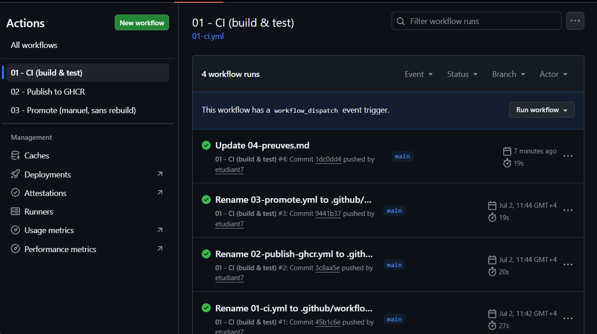
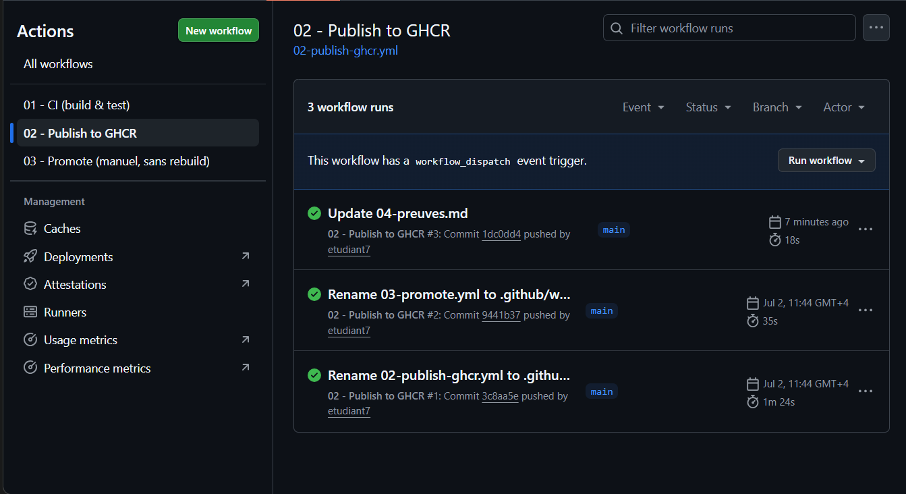
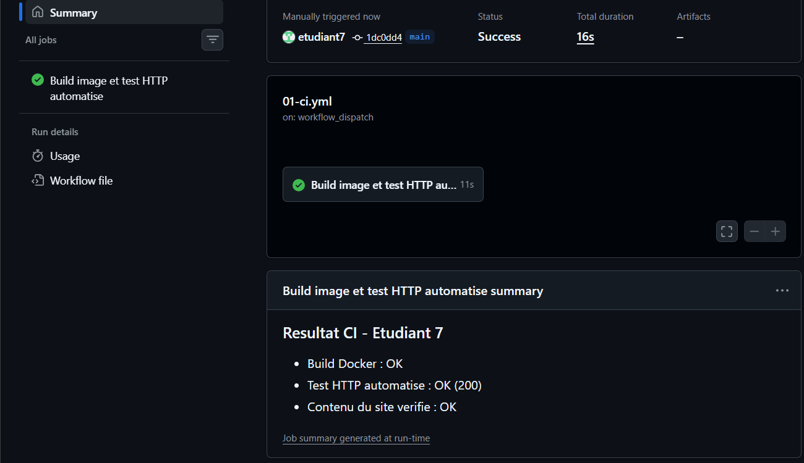
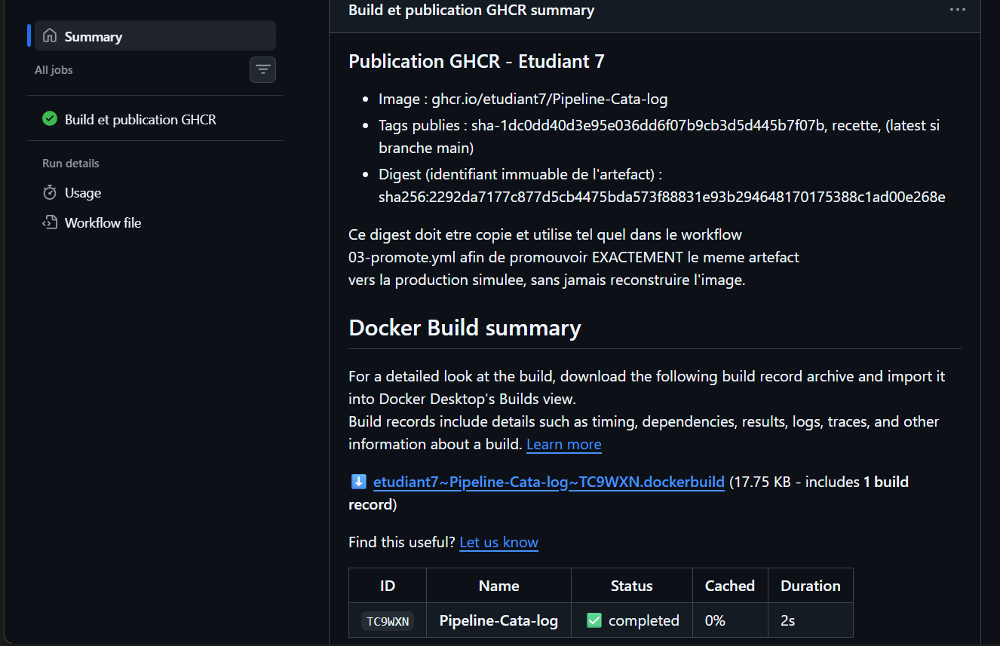

# 04 - Preuves d'exécution

**Auteur :** Etudiant 7

> Ce document liste toutes les preuves demandées par le référentiel EC06. Les liens et captures
> ci-dessous doivent être complétés après avoir poussé ce dépôt sur un compte GitHub personnel et
> exécuté réellement les workflows : une preuve ne peut être produite que par une exécution
> effective, elle ne peut pas être pré-remplie à l'avance.

## 1. Dépôt GitHub individuel

- Lien du dépôt : https://github.com/etudiant7/Pipeline-Cata-log

## 2. Exécutions GitHub Actions réussies

| Workflow | Lien du run | Statut |
|---|---|---|
| 01-ci.yml | https://github.com/etudiant7/Pipeline-Cata-log/actions/workflows/01-ci.yml — run #4 "Update 04-preuves.md", commit `1dc0dd4`, branche `main` | ✅ Success (16s) |
| 02-publish-ghcr.yml | https://github.com/etudiant7/Pipeline-Cata-log/actions/workflows/02-publish-ghcr.yml — run #3 "Update 04-preuves.md", commit `1dc0dd4`, branche `main` | ✅ Success |
| 03-promote.yml (recette) | commit `38d2b77`, déclenché manuellement, voir section 7 | ✅ Success (12s) |
| 03-promote.yml (production-simulee) | déclenché manuellement, voir section 8 | ✅ Success (13s) |

4 runs au total sur `01-ci.yml` (tous verts) et 3 runs sur `02-publish-ghcr.yml` (tous verts),
visibles dans l'onglet Actions du dépôt.




## 3. Preuve du build Docker automatisé

- Run `01-ci.yml` #4 (commit `1dc0dd4`) : job "Build image et test HTTP automatisé" — étape
  "Build de l'image Docker" exécutée avec succès (job complet en 11s). Résumé du run :
  "Build Docker : OK".

## 4. Preuve du test HTTP automatisé

- Run `01-ci.yml` #4 : résumé affiché dans `GITHUB_STEP_SUMMARY` —
  "Resultat CI - Etudiant 7 : Build Docker : OK / Test HTTP automatise : OK (200) / Contenu du
  site verifie : OK".
- Code HTTP obtenu : **200**.
- Capture d'écran : 

## 5. Preuve de publication GHCR

- Run `02-publish-ghcr.yml` #3 (commit `1dc0dd4`) terminé avec succès. Résumé du run :
  "Publication GHCR - Etudiant 7 — Image : ghcr.io/etudiant7/Pipeline-Cata-log".
- Build record Docker associé : `etudiant7~Pipeline-Cata-log~TC9WXN.dockerbuild`
  (ID `TC9WXN`, statut `completed`, durée 2s).
- Page du package GHCR : `[À COMPLETER — lien direct copié depuis l'onglet "Packages" du profil
  GitHub, ex: https://github.com/etudiant7?tab=packages]`

## 6. Tag et digest de l'image

- Tag(s) publiés : `sha-1dc0dd40d3e95e036dd6f07b9cb3d5d445b7f07b`, `recette` (et `latest` car
  branche `main`).
- Digest de l'image : `sha256:2292da7177c877d5cb4475bda573f88831e93b294648170175388c1ad00e268e`
- Commande utilisée pour vérifier :
  `docker buildx imagetools inspect ghcr.io/etudiant7/pipeline-cata-log@sha256:2292da7177c877d5cb4475bda573f88831e93b294648170175388c1ad00e268e`
- Capture d'écran : 

## 7. Preuve de validation en recette simulée

- Run `03-promote.yml` avec `target_environment = recette` : commit `38d2b77`, branche `main`,
  déclenché manuellement par `etudiant7`. Statut : ✅ Success (12s).
- Résultat du job (résumé `GITHUB_STEP_SUMMARY`) :
  ```
  Promotion - Etudiant 7
  - Environnement cible : recette
  - Digest source promu : sha256:2292da7177c877d5cb4475bda573f88831e93b294648170175388c1ad00e268e
  - Nouveau tag cree : recette
  - Aucun rebuild effectue (docker buildx imagetools create).
  ```
- Capture d'écran : 

## 8. Preuve de promotion vers production-simulee sans rebuild

- Run `03-promote.yml` avec `target_environment = production-simulee` : déclenché manuellement
  par `etudiant7`. Statut : ✅ Success (13s). Résumé du job :
  ```
  Promotion - Etudiant 7
  - Environnement cible : production-simulee
  - Digest source promu : sha256:2292da7177c877d5cb4475bda573f88831e93b294648170175388c1ad00e268e
  - Nouveau tag cree : production-simulee
  - Aucun rebuild effectue (docker buildx imagetools create).
  ```
- Capture d'écran : 
- Digest **avant** promotion (publié par `02-publish-ghcr.yml`, tag `recette`) :
  `sha256:2292da7177c877d5cb4475bda573f88831e93b294648170175388c1ad00e268e`
- Digest **après** promotion (tag `production-simulee`) :
  `sha256:2292da7177c877d5cb4475bda573f88831e93b294648170175388c1ad00e268e`
- Vérification : les deux digests sont **strictement identiques** → l'artefact promu en
  `production-simulee` est exactement le même que celui validé en `recette` (et publié
  initialement par `02-publish-ghcr.yml`) : aucun rebuild n'a eu lieu à aucune étape.

## 9. Extrait / lien vers compose.yml

- Fichier : [`compose.yml`](../compose.yml)
- Test local exécuté : `docker compose up --build` sur poste personnel (Windows, Docker Desktop /
  WSL2). Build réussi en local :
  - Image de base résolue : `docker.io/library/nginx:1.27-alpine@sha256:65645c7bb6a0661892a8b03b89d0743208a18dd2f3f17a54ef4b76fb8e2f2a10`
  - Étape `COPY site/ /usr/share/nginx/html/` exécutée (cache Docker sur rebuild).
  - Image locale construite et taguée `ghcr.io/etudiant7/site-catalog:local`, manifest
    `sha256:fa2e795061a24dac593ae1ff2d176ac455f30e665dd7a007d0a39f8d94a7bb5`.
  - Au démarrage : `Container site-catalog-web Running`, `Container site-catalog-monitor Running`.
  - Logs Nginx : requête `GET / HTTP/1.1" 200` confirmée dans `site-catalog-web`.
  - Logs du service `monitor` : `GET / HTTP/1.1" 200` avec `curl/8.10.1`, confirmant que le
    second service (`monitor`) interroge bien `web` via le réseau interne `catalog-net` —
    preuve concrète de la coordination des deux conteneurs (compétence C13).
- Capture d'écran du site rendu en local (`http://localhost:8080`, badge d'environnement
  "recette" affiché dynamiquement depuis `version.json`) :
  
- Capture d'écran du build : 
- Capture d'écran des logs web + monitor : 

## 10. Explication de la simulation de scaling et de ses limites

- Voir [`05-orchestration-scaling.md`](05-orchestration-scaling.md).
- Résultat de `docker compose up --build --scale web=2` (si testé) : `[À COMPLETER PAR L'ÉTUDIANT
  — non testé à ce stade ; le test réalisé jusqu'ici porte sur le démarrage standard (1 instance
  web + 1 monitor). Si non testé avant le rendu, l'indiquer explicitement ici et s'appuyer sur
  l'explication théorique de 05-orchestration-scaling.md.]`

## 11. Preuve ou justification du test local avec Docker / Docker Compose

- Preuve directe : test local réalisé avec succès via `docker compose up --build` (voir
  section 9 ci-dessus pour le détail des logs). Environnement : Windows avec Docker Desktop
  (backend WSL2, kernel `6.6.87.2-microsoft-standard-WSL2` visible dans les logs Nginx). Aucune
  justification de non-utilisation n'est nécessaire ici : le test local a été effectivement
  réalisé et documenté.

## 12. Preuve ou justification de l'utilisation d'une VM personnelle

- Justification de non-utilisation : les tests locaux ont été réalisés directement via Docker
  Desktop sur Windows (backend WSL2), sans VM personnelle dédiée supplémentaire. Le projet ne
  nécessite pas de serveur à administrer en continu : les GitHub-hosted runners couvrent
  l'intégralité du besoin d'exécution automatisée, et WSL2 fournit l'isolation nécessaire pour
  les tests locaux via Docker. Voir également `07-limites-et-tests.md`.

## 13. Fiche sécurité minimale

- Voir [`03-securite.md`](03-securite.md) — complétée.

## 14. Analyse des trois points obligatoires (secrets, rollback, sauvegarde/restauration)

- Voir [`06-analyse-production-reelle.md`](06-analyse-production-reelle.md) — complétée.

## 15. Compte rendu final personnel

- Voir [`08-compte-rendu-final.md`](08-compte-rendu-final.md) — complété.
