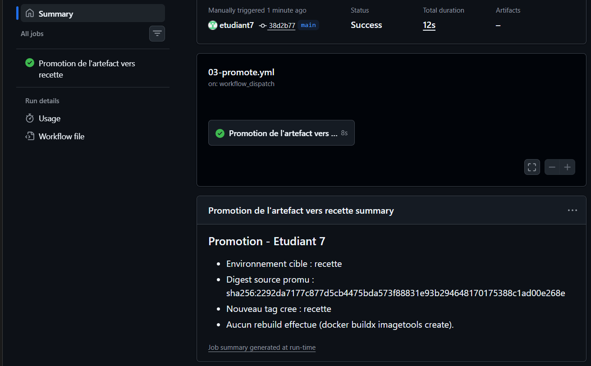
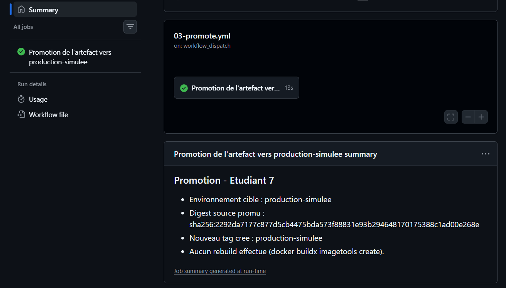
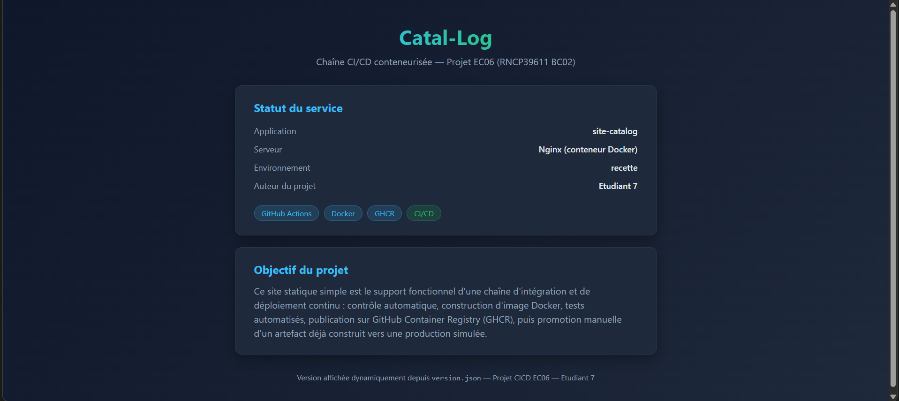
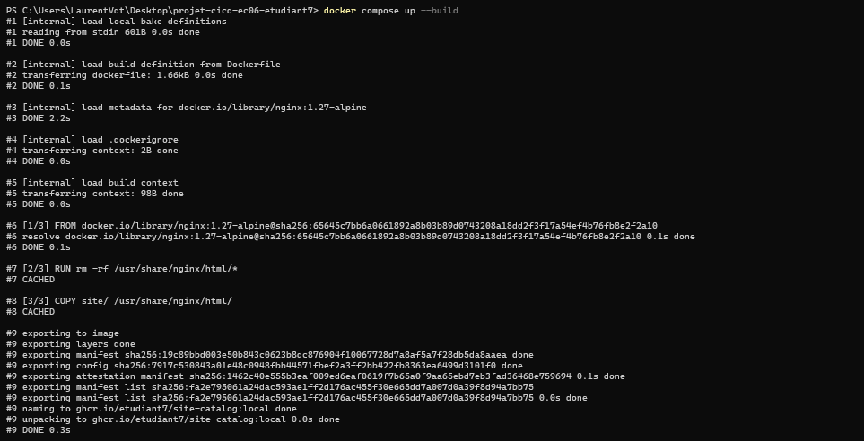
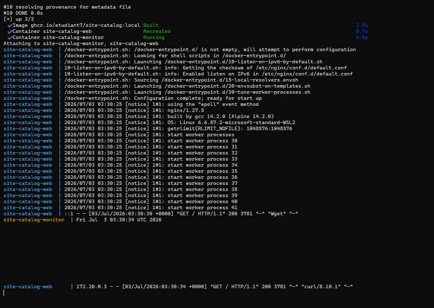

# 04 - Preuves d'execution

**Auteur :** Etudiant 7

> Ce document liste toutes les preuves demandees par le referentiel EC06.

## 1. Depot GitHub individuel

- Lien du depot : https://github.com/etudiant7/Pipeline-Cata-log

## 2. Executions GitHub Actions reussies

| Workflow | Lien du run | Statut |
|---|---|---|
| 01-ci.yml | https://github.com/etudiant7/Pipeline-Cata-log/actions/workflows/01-ci.yml -- run #4 "Update 04-preuves.md", commit `1dc0dd4`, branche `main` | Success (16s) |
| 02-publish-ghcr.yml | https://github.com/etudiant7/Pipeline-Cata-log/actions/workflows/02-publish-ghcr.yml -- run #3 "Update 04-preuves.md", commit `1dc0dd4`, branche `main` | Success |
| 03-promote.yml (recette) | commit `38d2b77`, declenche manuellement, voir section 7 | Success (12s) |
| 03-promote.yml (production-simulee) | declenche manuellement, voir section 8 | Success (13s) |

4 runs au total sur `01-ci.yml` (tous verts) et 3 runs sur `02-publish-ghcr.yml` (tous verts),
visibles dans l'onglet Actions du depot.


## 3. Preuve du build Docker automatise

- Run `01-ci.yml` #4 (commit `1dc0dd4`) : job "Build image et test HTTP automatise" -- etape
  "Build de l'image Docker" executee avec succes (job complet en 11s). Resume du run :
  "Build Docker : OK".

## 4. Preuve du test HTTP automatise

- Run `01-ci.yml` #4 : resume affiche dans `GITHUB_STEP_SUMMARY` --
  "Resultat CI - Etudiant 7 : Build Docker : OK / Test HTTP automatise : OK (200) / Contenu du
  site verifie : OK".
- Code HTTP obtenu : **200**.
- Capture d'ecran : 

## 5. Preuve de publication GHCR

- Run `02-publish-ghcr.yml` #3 (commit `1dc0dd4`) termine avec succes. Resume du run :
  "Publication GHCR - Etudiant 7 -- Image : ghcr.io/etudiant7/Pipeline-Cata-log".
- Build record Docker associe : `etudiant7~Pipeline-Cata-log~TC9WXN.dockerbuild`
  (ID `TC9WXN`, statut `completed`, duree 2s).
- Page du package GHCR : https://github.com/etudiant7/Pipeline-Cata-log/pkgs/container/pipeline-cata-log
- Note importante sur la mutabilite des tags : le workflow `02-publish-ghcr.yml` se declenche a
  chaque push sur `main`, donc le tag `recette` (et `latest`) est reattribue a chaque nouvelle
  publication et ne pointe plus forcement vers le digest `sha256:2292da71...` documente en
  section 6 au moment de la relecture de ce document. C'est attendu et sans consequence sur la
  validite de la demonstration : la promotion et la verification decrites dans les sections 7 et
  8 ont ete faites en ciblant explicitement ce digest precis (identifiant immuable), pas le tag
  mobile `recette`. Cet exemple illustre d'ailleurs concretement la difference entre un tag
  (mutable) et un digest (fixe) evoquee dans `08-compte-rendu-final.md`.

## 6. Tag et digest de l'image

- Tag(s) publies : `sha-1dc0dd40d3e95e036dd6f07b9cb3d5d445b7f07b`, `recette` (et `latest` car
  branche `main`).
- Digest de l'image : `sha256:2292da7177c877d5cb4475bda573f88831e93b294648170175388c1ad00e268e`
- Commande utilisee pour verifier :
  `docker buildx imagetools inspect ghcr.io/etudiant7/pipeline-cata-log@sha256:2292da7177c877d5cb4475bda573f88831e93b294648170175388c1ad00e268e`
- Capture d'ecran : 

## 7. Preuve de validation en recette simulee

- Run `03-promote.yml` avec `target_environment = recette` : commit `38d2b77`, branche `main`,
  declenche manuellement par `etudiant7`. Statut : Success (12s).
- Resultat du job (resume `GITHUB_STEP_SUMMARY`) :
  ```
  Promotion - Etudiant 7
  - Environnement cible : recette
  - Digest source promu : sha256:2292da7177c877d5cb4475bda573f88831e93b294648170175388c1ad00e268e
  - Nouveau tag cree : recette
  - Aucun rebuild effectue (docker buildx imagetools create).
  ```
- Capture d'ecran : 

## 8. Preuve de promotion vers production-simulee sans rebuild

- Run `03-promote.yml` avec `target_environment = production-simulee` : declenche manuellement
  par `etudiant7`. Statut : Success (13s). Resume du job :
  ```
  Promotion - Etudiant 7
  - Environnement cible : production-simulee
  - Digest source promu : sha256:2292da7177c877d5cb4475bda573f88831e93b294648170175388c1ad00e268e
  - Nouveau tag cree : production-simulee
  - Aucun rebuild effectue (docker buildx imagetools create).
  ```
- Capture d'ecran : 
- Digest **avant** promotion (publie par `02-publish-ghcr.yml`, tag `recette`) :
  `sha256:2292da7177c877d5cb4475bda573f88831e93b294648170175388c1ad00e268e`
- Digest **apres** promotion (tag `production-simulee`) :
  `sha256:2292da7177c877d5cb4475bda573f88831e93b294648170175388c1ad00e268e`
- Verification : les deux digests sont **strictement identiques** -> l'artefact promu en
  `production-simulee` est exactement le meme que celui valide en `recette` : aucun rebuild n'a
  eu lieu a aucune etape.

## 9. Extrait / lien vers compose.yml

- Fichier : [`compose.yml`](../compose.yml)
- Test local execute : `docker compose up --build` sur poste personnel (Windows, Docker Desktop /
  WSL2). Build reussi en local, image locale construite et taguee `ghcr.io/etudiant7/site-catalog:local`,
  manifest `sha256:fa2e795061a24dac593ae1ff2d176ac455f30e665dd7a007d0a39f8d94a7bb5`. Conteneurs
  `site-catalog-web` et `site-catalog-monitor` demarres et communiquant (logs HTTP 200 confirmes).
- Capture d'ecran du site rendu en local : 
- Capture d'ecran du build : 
- Capture d'ecran des logs web + monitor : 

## 10. Explication de la simulation de scaling et de ses limites

- Voir [`05-orchestration-scaling.md`](05-orchestration-scaling.md) pour l'explication complete.
- Resultat de `docker compose up --build --scale web=2` : non teste a son terme dans le temps
  imparti au projet. Un premier essai a ete fait et a revele que `container_name` fixe sur le
  service `web` empeche Docker Compose de creer plusieurs instances (erreur `Docker requires
  each container to have a unique name`). La correction (suppression de `container_name` et du
  port fixe) est documentee dans `05-orchestration-scaling.md` mais n'a pas ete revalidee par une
  execution reussie. Ceci est assume comme limite du rendu plutot que presente comme une preuve
  fournie ; le test realise et documente porte sur le demarrage standard (1 instance `web` + 1
  `monitor`, voir section 9).

## 11. Preuve ou justification du test local avec Docker / Docker Compose

- Preuve directe : test local realise avec succes via `docker compose up --build`. Environnement :
  Windows avec Docker Desktop (backend WSL2). Aucune justification de non-utilisation n'est
  necessaire ici : le test local a ete effectivement realise et documente.

## 12. Preuve ou justification de l'utilisation d'une VM personnelle

- Justification de non-utilisation : les tests locaux ont ete realises directement via Docker
  Desktop sur Windows (backend WSL2), sans VM personnelle dediee supplementaire. Les GitHub-hosted
  runners couvrent l'integralite du besoin d'execution automatisee.

## 13. Fiche securite minimale

- Voir [`03-securite.md`](03-securite.md) -- completee.

## 14. Analyse des trois points obligatoires (secrets, rollback, sauvegarde/restauration)

- Voir [`06-analyse-production-reelle.md`](06-analyse-production-reelle.md) -- completee.

## 15. Compte rendu final personnel

- Voir [`08-compte-rendu-final.md`](08-compte-rendu-final.md) -- complete.
